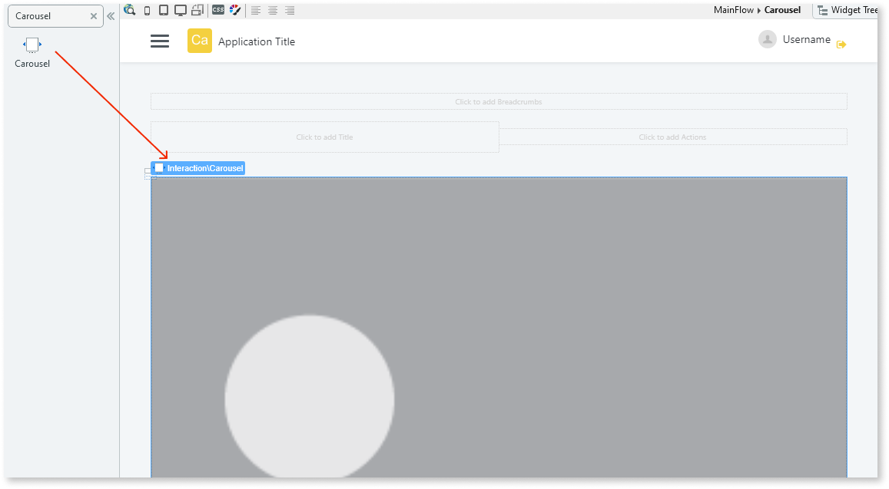

# Carousel Pattern

You can use the Carousel UI Pattern to display multiple items in a horizontal slide. This pattern is ideal for creating horizontal slides in smaller screens. You can also use this pattern for dynamic content, by placing a List directly inside the placeholder. 

## How to use the Carousel UI Pattern

1. In Service Studio, in the Toolbox, search for `Carousel`.
  
     The Carousel widget is displayed.

    
  

1. From the Toolbox, drag the Carousel widget into the Main Content area of your application's screen.

    

1. Place your content into the **Carousel Items** placeholder. 

    To use a List, drag it into **Carousel Items** placeholder (disable virtualization and set **Animated items** to False .

    

1. All available options have default properties, but you can change them.

    

After following these steps and publishing the module, you can test the pattern in your app.

## Properties

Property |  Description |  Default Value  
---|---|--- 
   Navigation  |  Enable or disable buttons to navigate left and right.  |  False
   Dots  |  Enable or disable dots to represent items on the Carousel, which can be tapped to navigate directly to a given item.  | True
   Margin  |  Set the distance between each Carousel item.  |  0 
   Padding  |  Set the distance between the screen edges and the visible items on the screen.  |  0
   AutoPlay  |  Enable or disable the autoplay velocity. |  Disabled
   Scale  |  Use the scale option for each carousel item.  |  False
   Loop  |  Enable or disable continuous slide of the Carousel even after it reaches the end.  |  False
   Center  |  Display the active item centered horizontally.  |  False
   InitialPosition  |  Set the first element to show.  | 0
   Items  |  Number of visible Carousel items at the same time on the screen.  |  1
  
 
## Compatibility with other patterns

Avoid using the Carousel inside patterns with swipe events, such as the Tabs and Stacked Cards Patterns.

## Samples

See how the [Product Dashboard sample](https://silkui.outsystems.com/Samples_Mobile.aspx#Mobile_Content-Samples_ProductDashboard) uses the Carousel pattern:

## See also
* OutSystems UI Live Style Guide: [Carousel](https://outsystemsui.outsystems.com/WebStyleGuidePreview/Carousel.aspx)
* OutSystems UI Pattern Page: [Carousel](https://outsystemsui.outsystems.com/OutSystemsUIWebsite/PatternDetail?PatternId=17)