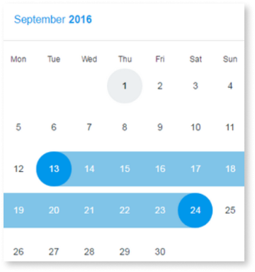

# Date Picker

You can use the Date Picker UI pattern as a graphical interface widget that allows the user to select a date from a calendar and/or time from a time range.

To display items in a gallery pattern, you can use static data or a **List** widget inside the block. 

  

The Date Picker UI pattern was created using the [Pikaday.js
library](https://github.com/dbushell/Pikaday/blob/master/README.md "https://github.com/dbushell/Pikaday/blob/master/README.md") .

## How to use the Date Picker UI Pattern

1. In Service Studio, in the Toolbox, search for `Date Picker`.
  
     The Date Picker widget is displayed.
   
      
  
1. From the Toolbox, drag the Date Picker widget onto your application's screen.

    You are prompted to create an event.
    
    

1. To access the picked date, you must create an Assign for the
**startDate** (if SelectInterval is False ).

1. Set the default value of the variable **PickedDate** as CurrDateTime().

    

After following these steps and publishing the module, you can test the pattern in your app. The result should look something like the following:

### Listing events of a selected day

1. Set the area where you want to put the list of events.

    

1. Create an entity with a **DateTime** attribute.

1. Set the entity in your **EventList** parameter on eventList, using the
right attribute to map.

      

1. Add the list to the page.

      

1. Create a Local Variable.

      

1. Get another Aggregate for the Events and set a filter on the aggregate:  
DateTimeToDate(Events.DateTime) = Date

    

**Result**:

    

## Properties

| **Properties** |  **Description** |  **Default Value** |
|---|---|---|
|   EventList  |  Receives a List of DateTime records that are used to highlight days as event days. |  none |
|  MinDate  |  Days before this date will be disabled. |  none  |
|  MaxDate  |  Days after this date will be disabled.  | none |  
|  InitialDate  |  The initially selected day for the DatePicker. If not set, it will be the current day by default.  |  Current Date | 
|  ShowWeekNumbers  |  Displays the week number on the left side of the DatePicker.  |  True  |
|  FirstWeekDay  |  Defines which weekday should be displayed first. %%  0: Sunday %% 1: Monday %% 2: Tuesday %% 3: Wednesday %% 4: Thursday %% 5: Friday %% 6: Saturday | 1 |
|  ShowTime  |  Displays a time picker below the DatePicker.  |  False |  
|  Show24HourFormat  |  Changes the time picker to a 24-hour format.  |  True  |
|  DisabledDaysList  |  Receives a List of DateTime records that will be disabled on the DatePicker. If this parameter is not set, all days between the MinDate and MaxDate are enabled. No default value.  |  none |  
|  DisabledWeekDays  |  String containing disabled weekdays. If the string is empty, all weekdays are active. Example with Sunday and Friday disabled: "0,5,6". %% 0: Sunday %% 1: Monday %% 2: Tuesday %% 3: Wednesday %% 4: Thursday %% 5: Friday %% 6: Saturday  |  none  |
| SelectInterval  |  Allows the selection between two dates. If set to True, the Block Event "On Select" has the values for both parameters.  |  False |  
  
## Events

| **Event Name** |  **Description** |  **Mandatory**  |
| ---|---|--- |  
|  OnSelect | Action to execute after selecting a DatePicker day. If SelectInterval is enabled, both parameters return values. If not, only the StartDate has a value.  |  True  |

## See also
* OutSystems UI Live Style Guide: [Date Picker](https://outsystemsui.outsystems.com/WebStyleGuidePreview/DatePicker.aspx)
* OutSystems UI Pattern Page: [Date Picker](https://outsystemsui.outsystems.com/OutSystemsUIWebsite/PatternDetail?PatternId=31)