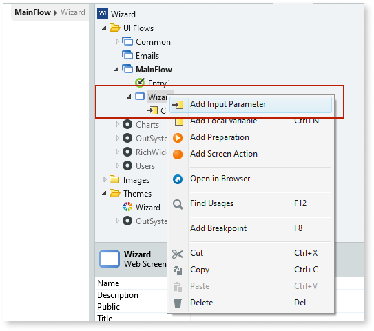
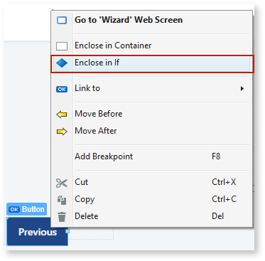
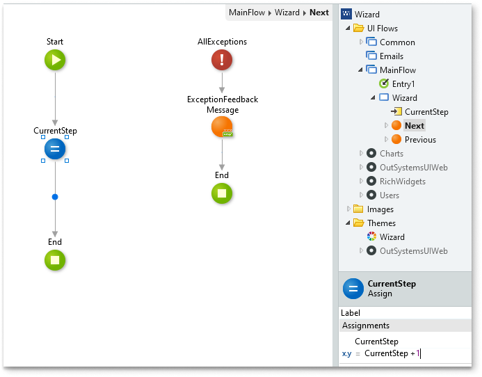

# Wizard 

You can use the Wizard UI Pattern to split large complex tasks and processes into smaller manageable steps. A wizard presents a series of steps or conditions that the user needs to complete in order to accomplish a goal. Additionally, wizards usually include explicit button navigation to move a step forward or backward. Some wizard examples include software installation wizards and sign-up screens.

**How to use the Wizard UI Pattern**

1. In Service Studio, in the Toolbox, search for `Wizard`. 

    The Wizard and Wizard Item widgets are displayed (both of which are required to use this pattern).
    
     

1. From the Toolbox, drag the Wizard widget onto your application's screen.

    By default, the Wizard widget contains three Wizard Item widgets. Each Wizard Item represents a step. You can add or delete Wizard Items as required.

    

**Create a wizard with navigation buttons**

The following example demonstrates how you can create a four step Wizard with navigation buttons.

1. From the Toolbox, drag another Wizard Item onto your screen. 

1. Rename each of the Wizard Items to the following: 
    * Shopping Details
    * Payment Details
    * Review Order
    * Confirm Order 

     

1. Create an Input Parameter by right-clicking on your module, and from the drop-down, select Add Input Parameter.
    
    

1. On the **Properties** tab, set the Input Parameter properties as follows: 

    

   In this example we call the input parameter **CurrentStep**. The CurrentStep input parameter controls the Wizard step that is shown to the user. Setting the Default Value to 1 ensures the Wizard always starts by showing step 1.

1. From the Toolbox, drag two Button widgets onto your screen and set their names to **Previous** and **Next**.

1. Define the behaviour for each of the navigation buttons, so that when clicked, they either move one step forward or backward. 
    
    

    In this example, we set the **On Click** behaviour for each of the buttons to:

    * stay on the current screen, and to
    * update the value of the **CurrentStep** input parameter to the next (CurrentStep + 1) or previous step (CurrentStep - 1) in the Wizard.

1. Create an expression that defines the status of each of the Wizard Items (active, past, next). Select the first Wizard Item (step 1), and on the **Properties** tab, from the **Step** drop-down, select **Expression Editor**. 

1. In the expression editor, enter the following expression:

    ` If(CurrentStep = 1, Entities.Step.Active,If(CurrentStep > 1, Entities.Step.Past, Entities.Step.Next)) `

    

    This expression has the following meaning:
    * If the user is on step 1, the step will show as the active step in the wizard
    * If the user is on a step greater than step 1, step 1 will show as a step that is in the past (completed).
    * If the user is on a step less than 1, the step will show as a next step.

    Repeat this for all of the Wizard Items. In this example we substitute the number 1 for 2, 3, and 4 respectively.

1. To create a condition that only displays the **Previous** button when applicable, which ensures that the user can never go below the number of steps in the Wizard, select the **Previous** button, right-click, and select **Enclose in If**.

     

1. On the **Properties** tab, in the **Condition** property, enter the following:

   `CurrentStep > 1`

    
       
   Repeat this step for the **Next** button. In this example, we use `CurrentStep < 3` for the **Next** button.

**Add content to your wizard**

1. To create a condition that controls what is displayed on screen, depending on what step is active, select a Wizard Item, right-click, and select **Enclose in If**.

1. On the **Properties** tab, in the **Condition** property, enter the following:

   `CurrentStep > 1`
           
    

Repeat this step for all of the Wizard Items. 

1. From the Toolbox, drag the relevant content to each of the Wizard Items in the Wizard.

     The following example shows the Shipping Details step that contains labels and input boxes.

      

1. Create Local Variables for each of the elements (for example, input boxes and labels) in the step container. 
    
    

**Create a screen action**

To ensure that all of the information the user enters is passed from step to step, you must create a [screen action](https://success.outsystems.com/Documentation/11/Reference/OutSystems_Language/Logic/Implementing_Logic/Logic_Elements/Screen_Action) for the **Previous** and **Next** navigation buttons.

1. Select the **Previous** button.

1. On the **Properties** tab, from the **Destination** drop-down, select **New Screen Action**.

    

1. From the Toolbox, drag the Assign block onto your screen and set the properties. This ensures that the user inputs get passed from step to step.

    

1. Repeat these steps for the **Previous** button.

After following all of the steps in each of the sections, you can publish the module, and test the Wizard in your app.

## Properties

### Wizard

| **Property** |  **Description** |  **Usage** | 
|---|---|---|
| Orientation (Orientation Identifier): Optional  |  Set the wizard orientation. By default the Wizard displays horizontally | The Orientation drop-down shows the different orientation options: <ul><li> Horizontal (_Entities.Orientation.Horizontal_) - The wizard displays horizontally </li></ul> <ul><li>Vertical (_Entities.Orientation.Vertical_) - The wizard displays vertically</ul></li>
| ExtendedClass (Text): Optional  |  Add custom style classes to the block. | 

### Wizard Item

| **Property** |  **Description** |  **Usage** | 
|---|---|---|
| Step (Step Identifier): Mandatory | Set the step. | Using an expression, you can set the status of a step to being active (the step the user is on) or inactive (a step the user has already completed or has yet to complete).
| UseTopLabel (Boolean) :Optional  |  If True, label is placed above the icon. If False, label is placed below the icon. | The text describing the step is either placed above or below the step icon.| 
| ExtendedClass (Text) : Optional |  Add custom style classes to the block. | 
  

## See also

* OutSystems UI Live Style Guide: [Wizard](https://outsystemsui.outsystems.com/WebStyleGuidePreview/Wizard.aspx)
* OutSystems UI Pattern Page: [Wizard](https://outsystemsui.outsystems.com/OutSystemsUIWebsite/PatternDetail?PatternId=82)

