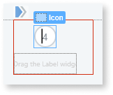
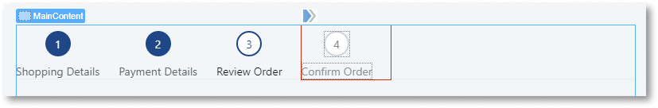
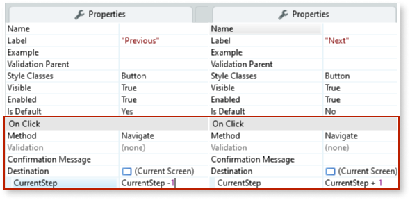
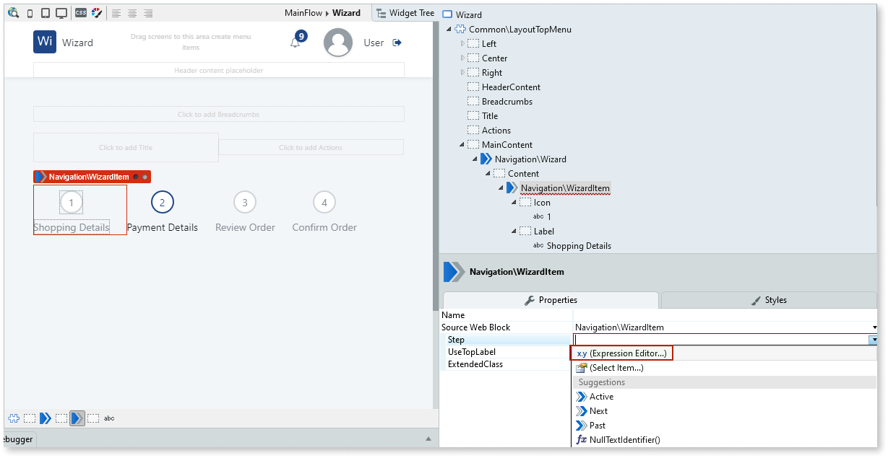
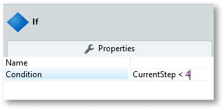
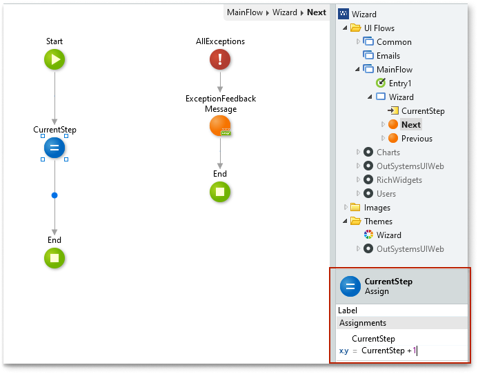

# Wizard 

You can use the Wizard UI Pattern to split large complex tasks and processes into smaller manageable steps. A wizard presents a series of steps or conditions that the user needs to complete in order to accomplish a goal. Additionally, wizards usually include explicit button navigation to move a step forward or backward. Some wizard examples include software installation wizards and sign-up screens.

## **How to use the Wizard UI Pattern**
#### Example use case 
The following example demonstrates how you can create a four step Wizard with navigation buttons. The example is made up of the following:
* Creating the wizard 
* Creating the wizard content
* Creating the wizard navigation

**Create a wizard**

1. In Service Studio, in the Toolbox, search for `Wizard`. 

    The Wizard and Wizard Item widgets are displayed (both of which are required to use this pattern).
    
     

1. From the Toolbox, drag the Wizard widget onto the main content area of your application's screen.

    

    By default, the Wizard widget contains three Wizard Item widgets. Each Wizard Item represents a step. You can add or delete Wizard Items as required.

1. From the Toolbox, drag another Wizard Item into your Wizard Pattern. 

     

1. Enter `4` for the new Wizard Item icon.

    

1. Rename each of the Wizard Items to the following: 
    * Shopping Details
    * Payment Details
    * Review Order
    * Confirm Order 

    

1. From the Element Tree, create an Input Parameter by right-clicking on your screen, and from the drop-down, select **Add Input Parameter**. 
 
    The input parameter controls which Wizard step is shown to the user. 
    
    

1. On the **Properties** tab, set the Input Parameter properties as follows: 
    * Name: CurrentStep 
    * Data Type: Integer
    * Is Mandatory: No
    * Default Value: 1

    

     By setting the **Default Value** to 1, you ensure that the  Wizard always starts on step 1.

1. From the Toolbox, drag two Button widgets onto your screen.

1. On the **Properties** tab, define the button names and the button behavior (previous and next).

    | **Property** |  **Button 1** | **Button 2**
    |---|---|---|
    | Label |  "Previous"| "Next"|
    | Method |  Navigate| Navigate|
    | Destination  | Current Screen |  Current Screen|
    | CurrentStep | CurrentStep - 1 | CurrentStep + 1

        

   You have now set the **On Click** behaviour for each of the buttons to:

    * **navigate** to the **current screen**, and to
    * update the value of the **CurrentStep** input parameter to the next (CurrentStep + 1) or previous step (CurrentStep - 1) in the Wizard.

1. To create the logic that defines the status of each step (active, past, next), select the first Wizard Item (step 1), and on the **Properties** tab, from the **Step** drop-down, select **Expression Editor**. 

    

1. In the expression editor, enter the following expression:

    ` If(CurrentStep = 1, Entities.Step.Active,If(CurrentStep > 1, Entities.Step.Past, Entities.Step.Next)) `

    

    This logic has the following meaning:
    * If the user is on step 1, the step will show as the active step in the wizard.
    * If the user is on a step greater than step 1, step 1 will show as a step that is in the past (completed).
    * If the user is on a step less than 1, the step will show as a next step.

1. Repeat steps 10 and 11 for all of the Wizard Items. Replace the number 1 in the expression with 2, 3, and 4 respectively.

1. To display the **Previous** button when applicable, select the **Previous** button, right-click, and select **Enclose in If**.

     

1. On the **Properties** tab, in the **Condition** property, enter the following:

   `CurrentStep > 1`

    

    You have now created a condition that ensures that the user can never go below the number of steps in the wizard.
       
1. Repeat steps 13 and 14 for the **Next** button. Enter `CurrentStep < 4` as the **Condition** property. This ensures the **Next** button is only displayed when applicable, and the user can never go above the number of steps in the wizard.

**Add content to your wizard**

1. From the Toolbox, drag the If widget onto the main content area of your application's screen, just below the Wizard Pattern.

    

1. On the **Properties** tab, in the **Condition** property, enter the following:

   `CurrentStep = 1`
           
    

    You have now created a condition that controls what is displayed on screen when the step is acive.

1. Repeat steps 1 and 2 for all of the Wizard Items. Replace **Condition** property with 2, 3, and 4 respectively.

1. In the top section (True) of each of the If widgets, create the relevant content for each of the steps.

     The following example shows a Shipping Details step that contains labels and input boxes.

      

**Create the wizard navigation**

To ensure that all of the information the user enters is passed from step to step, you must create a [screen action](https://success.outsystems.com/Documentation/11/Reference/OutSystems_Language/Logic/Implementing_Logic/Logic_Elements/Screen_Action) for the **Previous** and **Next** navigation buttons.

1. Select the **Next** button.

1. On the **Properties** tab, from the **Destination** drop-down, select **New Screen Action**.

    

1. From the Toolbox, drag the Assign block onto your screen and set the **Variable** property to ``CurrentStep`` and the Value property to ``CurrentStep + 1``. This ensures that user inputs get passed from step to step.

    

1. Repeat steps 2 and 3 for the **Previous** button.

After following all of the steps in each of the sections, you can publish the module, and test the Wizard in your app.

## Properties

### Wizard

| **Property** |  **Description** | 
|---|---|
| Orientation (Orientation Identifier): Optional  |  Set the wizard orientation. By default the Wizard displays horizontally. The Orientation drop-down shows the different orientation options: <ul><li> Horizontal (_Entities.Orientation.Horizontal_) - The wizard displays horizontally </li></ul> <ul><li>Vertical (_Entities.Orientation.Vertical_) - The wizard displays vertically</ul></li>
| ExtendedClass (Text): Optional  |  Add custom style classes to the block. 

### Wizard Item

| **Property** |  **Description** | 
|---|---|---|
| Step (Step Identifier): Mandatory | Set the step. | Using an expression, you can set the status of a step to being active (the step the user is on) or inactive (a step the user has already completed or has yet to complete).
| UseTopLabel (Boolean) :Optional  |  If True, label is placed above the icon. If False, label is placed below the icon. | The text describing the step is either placed above or below the step icon.| 
| ExtendedClass (Text) : Optional |  Add custom style classes to the block. | 
  

## See also

* OutSystems UI Live Style Guide: [Wizard](https://outsystemsui.outsystems.com/WebStyleGuidePreview/Wizard.aspx)
* OutSystems UI Pattern Page: [Wizard](https://outsystemsui.outsystems.com/OutSystemsUIWebsite/PatternDetail?PatternId=82)

