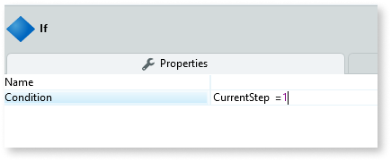
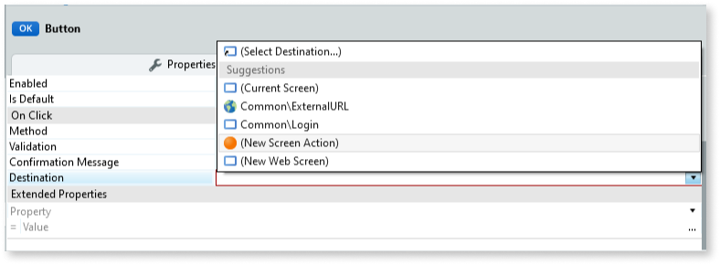

# Wizard UI Pattern
You can use the Wizard UI pattern to split large complex tasks and processes into smaller manageable steps. Wizards usually include explicit button navigation to move a step forward or backward. 

**How to Use the Wizard UI Pattern**

1. In Service Studio, in the Toolbox, search for  `Wizard`. 

    The Wizard widget is displayed.
    
     

1. From the Toolbox, drag the Wizard widget onto your application's screen.

    By default, the Wizard widget contains three Wizard Item blocks. Each Wizard Item represents a step. You can add or delete Wizard Items as required.

    

**Create a Wizard with Navigation Buttons**

The following example demonstrates how you can create a three step Wizard with navigation buttons.

1. Rename each of the Wizard Items to the following: 
    * Shopping Details
    * Payment Details
    * Review Order

        

1. Create an Input Parameter with the following properties:
    
    
 
    This input paramenter controls the current Wizard step. 
    Setting the **Default Value** to 1 ensures the Wizard always starts at step 1.

1. From the Toolbox, drag two Button widgets onto your screen and set their names to **Previous** and **Next**.

1. Define the behaviour for each of the navigation buttons. 

      

1. Create an expression that defines the status of each of the Wizard Items (current step, step already completed, step yet to be completed), depending on what stage the user is at.

    

1. Create a condition for both the **Previous** and **Next** buttons. This ensures that theuser can never goes above or below the actual number of steps in the Wizard.

    

**Add Content to your Wizard**

1. Create a condition to control what is displayed, depending on what step is active.
    
    

1. Add the relevant content to each for each of the steps.

     The following example shows the Shipping Details step that contains text and input boxes.

      

1. Create variables for each of the elements in the step container. 
    
    

**Create a Screen Action**

To ensure that all of the information the user enters is passed from step to step, you must create a screen action for the **Previous** and **Next** navigation buttons.

1. Select the **Previous** button.
1. On the **Properties** tab, from the **Destination** drop-down, select **(New Screen Action)**.

    

1. From the Toolbox, drag the Assign block onto your screen and set the properties. This ensures that the user inputs get passed from step to step.

1. Repeat these steps for the **Previous** button.

After following all of the steps in each of the sections, you can publish the module, and test the Wizard in your app.

## Properties

### Wizard

| **Property** |  **Description** |  **Usage** | 
|---|---|---|
| Orientation (Orientation Identifier): Optional  |  Set the wizard orientation. |<ul><li>_Entities.Orientation.Horizontal_ - The wizard displays horizontally </li></ul> <ul><li>_Entities.Orientation.Vertical_ - The wizard displays vertically</ul></li>
| ExtendedClass (Text): Optional  |  Add custom style classes to the block. | 

### Wizard Item

| **Property** |  **Description** |  **Usage** | 
|---|---|---|
| Step (Step Identifier): Mandatory | Set the step. | Using an expression, you can set the status of a step to being active (the step the user is on) of inactive (a step the user has already completed or has yet to complete).
| UseTopLabel (Boolean) :Optional  |  If True, label is placed above the icon. If False, label is placed below the icon. | The text describing the step is either placed above or below the step icon.| 
| ExtendedClass (Text) : Optional |  Add custom style classes to the block. | 
  

## See Also

* OutSystems UI Live Style Guide: [Wizard](https://outsystemsui.outsystems.com/WebStyleGuidePreview/Wizard.aspx)
* OutSystems UI Pattern Page: [Wizard](https://outsystemsui.outsystems.com/OutSystemsUIWebsite/PatternDetail?PatternId=82)

