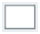

---
tags:
summary: 
---

# SplitScreen UI Pattern Reference

## Events

**Event Name** |  **Description** |  **Mandatory**  
---|---|---  
  DetailClose  |  Triggered when the detail (or right side of the splitscreen) is closed.  |  False 
  
## Layout and Classes

## CSS Selectors

**Element** |  **CSS Class** |  **Description**  
---|---|---  
 |  MasterDetail Wrapper  |  .split-screen-wrapper  |  Container that wraps elements in left and right container.  
 |  Left Content  |  .split-left  |  Add content for the Left side.  
 |  Right Content  |  .split-right  |  Add content for the Right side. In phone view, this Element is off canvas.  
 |  Close Right Content  |  .split-right-close  |  
  

 ## See Also

* OutSystems UI Pattern Documentation: [SplitScreen](https://success.outsystems.com/Documentation/11/Developing_an_Application/Design_UI/Patterns/Using_Mobile_Patterns/SplitScreen_Pattern)
